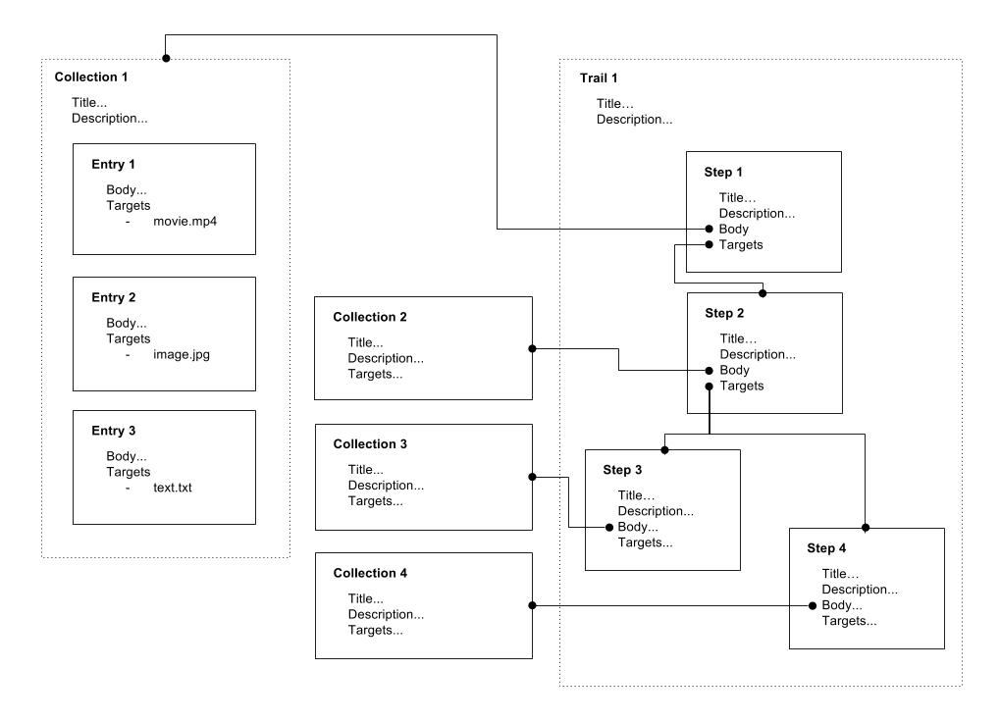

# Introduction

This is a proposal for a method to define linear and nonlinear narrative 'trails' of content using the [Web Annotation Data Model](https://www.w3.org/TR/annotation-model/).
The goal is to permit a 'Memex-like' application where users 'bookmark' content in a local database which provides a searchable index and UI allowing entries to be combined into 'collections', which in turn can be referenced in each 'step' of a greater narrative 'trail'. The elements of this model should be sufficiently decoupled as to allow remixing entries and collections into other narrative trails.
The model makes use of 'meta-annotations' (annotations targeting annotations) to create the proposed structures.

## IPFS
It is possible to store these JSON-LD annotations in IPFS/IPLD. To do so, the `id` property must be excluded as per [this discussion](https://github.com/ipfs/notes/issues/152#issuecomment-239153915).
Content IRIs starting with `http://examples.org/` can be replaced with a `fs:/ipfs/QmContent/` IRI, thus adhering to the Web Annotation Data Model.
A consuming client application can interpret these IRIs as necessary. 



This example defines: 

- Three **entry** objects describing .mp4, .jpg, and .txt files defined as annotations with the `describing` or `bookmarking` motivation.

- Four **collection**s defined as annotations with a `linking` motivation, each targeting a List (ordered) or Composite (unordered) of **entry** objects.

- One **trail** defined as an annotation with a `linking` motivation, targeting a List of **step**s. 

- Four **step**s defined as annotations with a `linking` motivation, linking a **collection** to one or more **step**s.

Note that a `body` property is [not required by the Web Annotation Data Model](https://www.w3.org/TR/annotation-model/#cardinality-of-bodies-and-targets). Collections and Trails make use of this fact.

A client application would display this media using whatever layout/navigation strategy it sees fit - perhaps a custom `mx:layoutStrategy` property could be used?

I propose an additional `mx` namespace via the `fs:/ipfs/QmContent/vocab/memex.jsonld` `@context`. This gives us `mx:type` which can be used to index memex records (entries, collections, trails, steps) by type.

# Entries

## Entry 1
http://example.org/entry1

```
{
  "@context": ["http://www.w3.org/ns/anno.jsonld", "http://example.org/vocab/memex.jsonld"],
  "id": "http://example.org/entry1",
  "type": "Annotation",
  "mx:type": "entry",
  "motivation": "describing", // or bookmarking (body not required)
  "body": {
    "type": "Choice", // allow multiple languages
    "items": [
      {
          "type": "TextualBody",
          "value": "Awesome movie",
          "format": "text/html",
          "language" : "en"
      },
      {
          "type": "TextualBody",
          "value": "Toller Film",
          "format": "text/html",
          "language" : "de"
      }
    ]
  },
  "target": "http://example.org/movie.mp4"
}
```

## Entry 2
http://example.org/entry2

```
{
  "@context": ["http://www.w3.org/ns/anno.jsonld", "http://example.org/vocab/memex.jsonld"],
  "id": "http://example.org/entry2",
  "type": "Annotation",
  "mx:type": "entry",
  "motivation": "describing", // or bookmarking (body not required)
  "body": {
    "type": "Choice", // allow multiple languages
    "items": [
      {
          "type": "TextualBody",
          "value": "Awesome movie",
          "format": "text/html",
          "language" : "en"
      },
      {
          "type": "TextualBody",
          "value": "Super Bild",
          "format": "text/html",
          "language" : "de"
      }
    ]
  },
  "target": "http://example.org/image.jpg"
}
```

## Entry 3
http://example.org/entry3

```
{
  "@context": ["http://www.w3.org/ns/anno.jsonld", "http://example.org/vocab/memex.jsonld"],
  "id": "http://example.org/entry3",
  "type": "Annotation",
  "mx:type": "entry",
  "motivation": "describing", // or bookmarking (body not required)
  "body": {
    "type": "Choice", // allow multiple languages
    "items": [
      {
          "type": "TextualBody",
          "value": "Awesome text",
          "format": "text/html",
          "language" : "en"
      },
      {
          "type": "TextualBody",
          "value": "ehrfürchtig Text",
          "format": "text/html",
          "language" : "de"
      }
    ]
  },
  "target": "http://example.org/text.txt"
}
```

# Collections

## Collection 1
http://example.org/collection1

```
{
  "@context": ["http://www.w3.org/ns/anno.jsonld", "http://example.org/vocab/memex.jsonld"],
  "id": "http://example.org/collection1",
  "type": "Annotation",
  "mx:type": "collection",
  "motivation": "linking",
  "dc:title": "Collection 1",
  "dc:description": "I link the targeted entries to collection1",
  "target": {
    "type": "List", // show the items in this order
    "items": [
      "http://example.org/entry1",
      "http://example.org/entry2",
      "http://example.org/entry3"
    ]
  }
}
```

## Collection 2
http://example.org/collection2

```
{
  "@context": ["http://www.w3.org/ns/anno.jsonld", "http://example.org/vocab/memex.jsonld"],
  "id": "http://example.org/collection2",
  "type": "Annotation",
  "mx:type": "collection",
  "motivation": "linking",
  "dc:title": "Collection 2",
  "dc:description": "I link the targeted entries to collection2",
  "target": {
    "type": "Composite", // show the items in any order
    "items": [
      "http://example.org/entry4,
      "http://example.org/entry5",
      "http://example.org/entry6"
    ]
  }
}
```

## Collection 3
http://example.org/collection3

```
{
  "@context": ["http://www.w3.org/ns/anno.jsonld", "http://example.org/vocab/memex.jsonld"],
  "id": "http://example.org/collection3",
  "type": "Annotation",
  "mx:type": "collection",
  "motivation": "linking",
  "dc:title": "Collection 3",
  "dc:description": "I link the targeted entries to collection3",
  "target": {
    "type": "Composite", // show the items in any order
    "items": [
      "http://example.org/entry7,
      "http://example.org/entry8",
      "http://example.org/entry9"
    ]
  }
}
```

## Collection 4
http://example.org/collection4

```
{
  "@context": ["http://www.w3.org/ns/anno.jsonld", "http://example.org/vocab/memex.jsonld"],
  "id": "http://example.org/collection4",
  "type": "Annotation",
  "mx:type": "collection",
  "motivation": "linking",
  "dc:title": "Collection 4",
  "dc:description": "I link the targeted entries to collection4",
  "target": {
    "type": "Composite", // show the items in any order
    "items": [
      "http://example.org/entry10,
      "http://example.org/entry11",
      "http://example.org/entry12"
    ]
  }
}
```

# Trails

## Trail 1
http://example.org/trail1

```
{
  "@context": ["http://www.w3.org/ns/anno.jsonld", "http://example.org/vocab/memex.jsonld"],
  "id": "http://example.org/trail1",
  "type": "Annotation",
  "mx:type": "trail",
  "motivation": "linking",
  "dc:title": "Trail 1",
  "dc:description": "I link the targeted steps to trail1",
  "target": {
    "type": "List", // specific order
    "items": [
      "http://example.org/step1",
      "http://example.org/step2",
      "http://example.org/step3",
      "http://example.org/step4"
    ]
  }
}
```

# Steps

## Step 1
http://example.org/step1

```
{
  "@context": ["http://www.w3.org/ns/anno.jsonld", "http://example.org/vocab/memex.jsonld"],
  "id": "http://example.org/step1",
  "type": "Annotation",
  "mx:type": "step",
  "motivation": "linking",
  "dc:title": "Step 1",
  "dc:description": "I'm the first part of trail1 linking collection 1 to step2",
  "body": "http://example.org/collection1",
  "target": "http://example.org/step2" // linear
}
```

## Step 2
http://example.org/step2

```
{
  "@context": ["http://www.w3.org/ns/anno.jsonld", "http://example.org/vocab/memex.jsonld"],
  "id": "http://example.org/step2",
  "type": "Annotation",
  "mx:type": "step",
  "motivation": "linking",
  "dc:title": "Step 2",
  "dc:description": "I'm the second part of trail1 linking collection2 to step3 and step4",
  "body": "http://example.org/collection2",
  "target": {
    "type": "Composite", // no specific order - nonlinear
    "items": [
      "http://example.org/step3",
      "http://example.org/step4"
    ]
  }
}
```

## Step 3
http://example.org/step3

```
{
  "@context": ["http://www.w3.org/ns/anno.jsonld", "http://example.org/vocab/memex.jsonld"],
  "id": "http://example.org/step3",
  "type": "Annotation",
  "mx:type": "step",
  "motivation": "linking",
  "dc:title": "Step 3",
  "dc:description": "I'm the third part of trail1 linking collection3 to ...",
  "body": "http://example.org/collection3",
  "target": ...
}
```

## Step 4
http://example.org/step4

```
{
  "@context": ["http://www.w3.org/ns/anno.jsonld", "http://example.org/vocab/memex.jsonld"],
  "id": "http://example.org/step4",
  "type": "Annotation",
  "mx:type": "step",
  "motivation": "linking",
  "dc:title": "Step 4",
  "dc:description": "I'm the fourth part of trail1 linking collection4 to ...",
  "body": "http://example.org/collection4",
  "target": ...
}
```